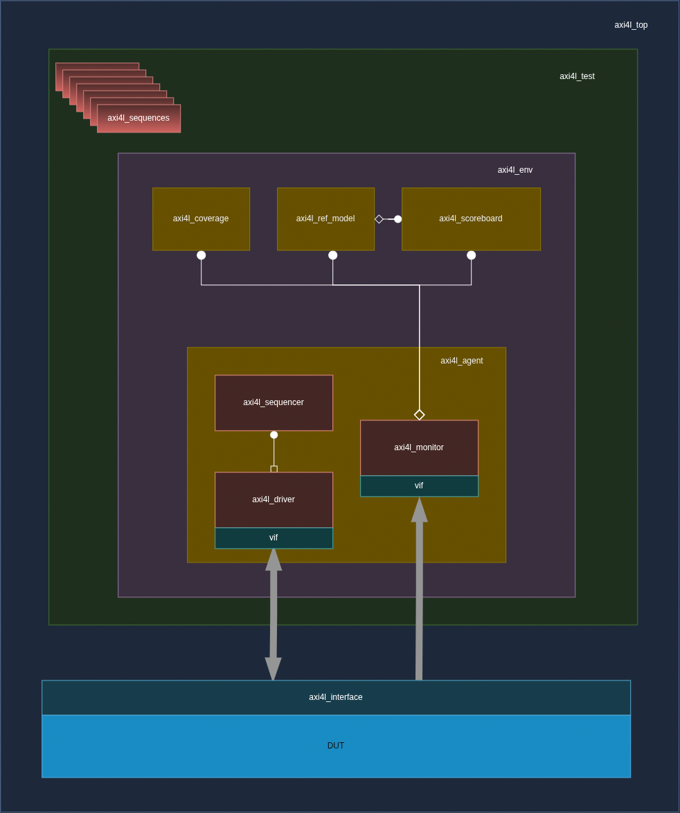

# Testbench Architecture

## Overview

The verification environment is a fully layered **UVM 1.2** testbench targeting the AXI4-Lite slave DUT. It follows standard UVM component hierarchy — test → environment → agent → driver/monitor — with a dedicated scoreboard, reference model, functional coverage collector, and SVA assertions bound to the interface.

---

## Block Diagram


## Component Hierarchy

```
uvm_test (axi4l_test)
└── uvm_env (axi4l_env)
    ├── axi4l_agent [ACTIVE]
    │   ├── axi4l_sequencer
    │   ├── axi4l_driver
    │   └── axi4l_monitor
    ├── axi4l_scoreboard
    ├── axi4l_ref_model
    └── axi4l_coverage
```

---

## Component Descriptions

### axi4l_test (`tb/tests/axi4l_test.sv`)

Top-level UVM test class. Instantiates the environment, selects and starts the appropriate sequence on the sequencer. All test variants (write-only, read-only, error injection, concurrent, fully-random) are implemented as separate sequence classes selected at runtime via `+UVM_TESTNAME`.

### axi4l_env (`tb/env/axi4l_env.sv`)

UVM environment that instantiates and connects all sub-components. Connects the monitor's analysis port to the scoreboard and coverage collector TLM ports. Sets the virtual interface handle into `uvm_config_db` for the agent.

### axi4l_agent (`tb/agents/axi4lite_agent/axi4l_agent.sv`)

Active UVM agent encapsulating the driver, monitor, and sequencer. Configured in ACTIVE mode for full stimulus and observation capability. Passes the virtual interface handle down to the driver and monitor.

### axi4l_driver (`tb/agents/axi4lite_agent/axi4l_driver.sv`)

Converts `axi4l_seq_item` transactions into cycle-accurate AXI4-Lite pin-level stimulus on all five channels. Drives the Write Address, Write Data, and Read Address channels as a master would. Handles:
- VALID/READY handshake timing with configurable wait states via `wait_cfg_vector`
- Concurrent read+write dispatch when `txn_sel == 2'b11`
- Byte-enable (WSTRB) driven per transaction

### axi4l_monitor (`tb/agents/axi4lite_agent/axi4l_monitor.sv`)

Passively observes all AXI4-Lite channel signals. Reconstructs complete transactions (address + data + response) and broadcasts them via a `uvm_analysis_port` to both the scoreboard and the coverage collector. Does not drive any DUT pins.

### axi4l_sequencer (`tb/agents/axi4lite_agent/axi4l_sequencer.sv`)

Standard `uvm_sequencer #(axi4l_seq_item)`. Arbitrates between sequences and passes sequence items to the driver.

### axi4l_scoreboard (`tb/env/axi4l_scoreboard.sv`)

Receives observed transactions from the monitor. For each transaction, calls the reference model to compute the expected response, then compares expected vs actual BRESP/RRESP and RDATA. Reports `UVM_ERROR` on mismatch. Maintains pass/fail counts reported at end of test.

### axi4l_ref_model (`tb/env/axi4l_ref_model.sv`)

Golden software model of the AXI4-Lite slave register file. Implements the same address decode, access permission, and error response logic as the DUT. Used by the scoreboard for expected value prediction. Maintains an internal shadow register file updated on every successful write.

### axi4l_coverage (`tb/env/axi4l_coverage.sv`)

Functional coverage collector subscribed to the monitor's analysis port. Implements covergroups for:
- Address region hits (R/W, R/O, W/O, DECERR, unaligned)
- AXI response encoding (OKAY, SLVERR, DECERR) for both read and write
- Transaction type (write-only, read-only, concurrent R+W)
- WSTRB byte-enable combinations (4'b0001 through 4'b1111)
- Boundary addresses (0x00, 0x3C, 0x40)

---

## Interface and Assertions (`tb/interfaces/axi4l_if.sv`, `tb/assertions/axi4l_assertions.sv`)

The SystemVerilog interface `axi4l_if` defines all AXI4-Lite signals with a synchronous clocking block for the driver and a monitor clocking block for sampling. SVA properties in `axi4l_assertions.sv` are bound to the interface and check:

- AWVALID must remain asserted until AWREADY is observed (VALID stability rule)
- WVALID must remain asserted until WREADY is observed
- ARVALID must remain asserted until ARREADY is observed
- BVALID assertion follows a completed write address + data handshake
- No X/Z propagation on response signals (BRESP, RRESP) when VALID is high
- Reset clears all VALID signals on the next clock edge

---

## Sequence Item (`tb/seq_items/axi4l_seq_item.sv`)

`axi4l_seq_item` extends `uvm_sequence_item` and contains:

| Field | Type | Description |
|---|---|---|
| `txn_sel` | `rand bit [1:0]` | 2'b01=write, 2'b10=read, 2'b11=concurrent |
| `AWADDR` | `rand bit [31:0]` | Write address |
| `ARADDR` | `rand bit [31:0]` | Read address |
| `WDATA` | `rand bit [31:0]` | Write data |
| `WSTRB` | `rand bit [3:0]` | Byte enables |
| `wait_cfg_vector` | `rand bit [7:0]` | [7:4]=read wait, [3:0]=write wait cycles |

---

## Transaction Flow

```
Test selects sequence
    │
    ▼
Sequencer arbitrates → Driver receives seq_item
    │                        │
    │                        ▼
    │              Drives AXI4-Lite pins
    │              (AWVALID, WVALID, ARVALID...)
    │                        │
    │                   DUT responds
    │              (AWREADY, WREADY, BVALID, RVALID...)
    │                        │
    ▼                        ▼
Monitor observes transaction
    │
    ├──► Scoreboard: compare vs Ref Model → PASS/FAIL
    └──► Coverage: sample covergroups
```

---

## TB Quality / Sanity Checks

- **Reference RTL validation**: `axi4_lite_slave.sv` (clean RTL) was run first through the full regression to confirm zero scoreboard errors — establishing TB correctness before running against the buggy DUT.
- **Bug injection**: `axi4l_write_bug_seq` specifically targets a known suspected bug scenario (write at 0x10 followed by read at 0x10) to reproduce and isolate RTL defects.
- **SVA**: Protocol-level assertions provide a second independent check layer beyond scoreboard data checking.
- **Fully random regression**: `axi4l_fully_rand` (5000 transactions) provides broad stimulus diversity beyond directed tests.
